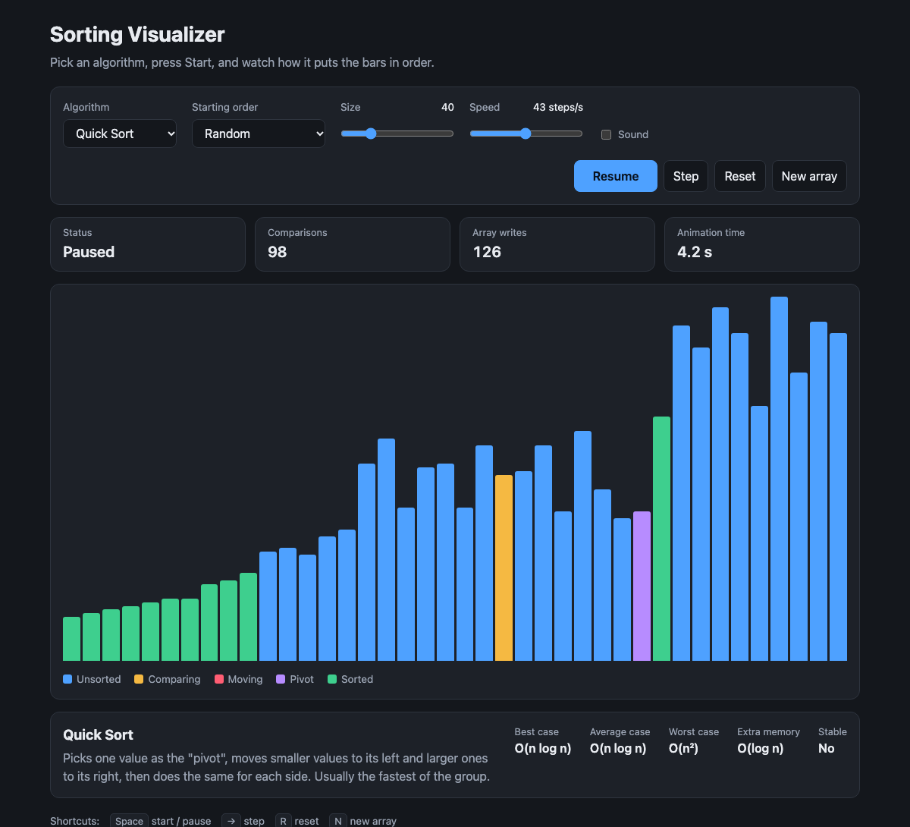
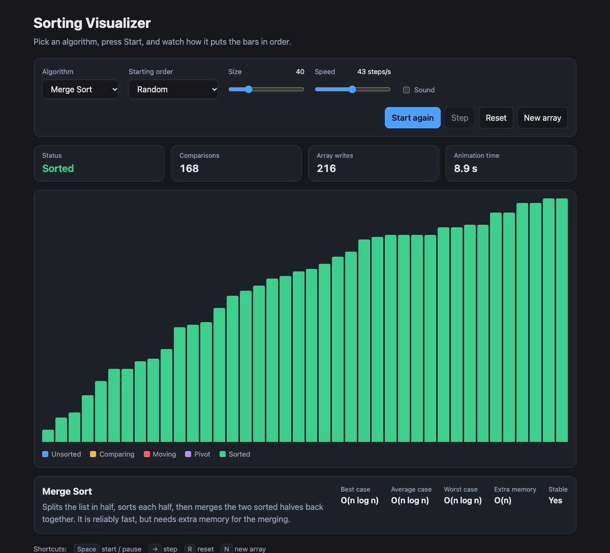

# Sorting Visualizer

Watch sorting algorithms work, one step at a time.

Each bar is a number: the taller the bar, the bigger the number. Pick an algorithm, press **Start**, and see how it moves the bars until they are in order from smallest to largest.

**[Try it in your browser](https://amroamro404.github.io/Sorting-Visualizer/)** (nothing to install)



## What you can do

- **Compare 7 algorithms**: Bubble, Insertion, Selection, Shell, Merge, Quick and Heap Sort.
- **Control the animation**: start, pause, resume, or go forward one step at a time.
- **Change the speed** from 2 to 1,000 steps per second, even while it is running.
- **Change the size** of the array, from 5 to 150 bars. With 20 bars or fewer, each bar shows its number.
- **Choose the starting order**: random, nearly sorted, reversed, or only a few different values.
- **Replay the same array** with a different algorithm, so the comparison is fair.
- **See the numbers**: how many comparisons and array writes the algorithm needed.
- **Read a short explanation** of the selected algorithm and how fast it is.
- **Turn on sound** to hear the sort as well as see it.

It works on phones, and follows your device's light or dark theme.

## How to use it

1. Choose an **Algorithm** and a **Starting order**.
2. Set the **Size** and **Speed** with the sliders.
3. Press **Start**.

| Button | What it does | Keyboard |
| --- | --- | --- |
| Start / Pause / Resume | Runs or pauses the animation | `Space` |
| Step | Moves forward by one step | `→` or `S` |
| Reset | Puts the bars back the way they were before sorting | `R` |
| New array | Makes a new set of bars | `N` |

### What the colours mean

| Colour | Meaning |
| --- | --- |
| Blue | Not sorted yet |
| Yellow | The two bars being compared right now |
| Red | A bar that was just moved |
| Purple | The pivot (Quick Sort only) |
| Green | In its final place |



## The algorithms

"n" is the number of bars. Smaller growth means the algorithm stays fast as the array gets bigger.

| Algorithm | Best case | Average case | Worst case | Extra memory | Stable |
| --- | --- | --- | --- | --- | --- |
| Bubble Sort | O(n) | O(n²) | O(n²) | O(1) | Yes |
| Insertion Sort | O(n) | O(n²) | O(n²) | O(1) | Yes |
| Selection Sort | O(n²) | O(n²) | O(n²) | O(1) | No |
| Shell Sort | O(n log n) | O(n^1.5) | O(n²) | O(1) | No |
| Merge Sort | O(n log n) | O(n log n) | O(n log n) | O(n) | Yes |
| Quick Sort | O(n log n) | O(n log n) | O(n²) | O(log n) | No |
| Heap Sort | O(n log n) | O(n log n) | O(n log n) | O(1) | No |

*Stable* means that equal values keep their original order.

**About the time shown on the page:** "Animation time" is how long the animation has been playing, so it depends on the speed slider. To compare algorithms fairly, look at **Comparisons** and **Array writes** instead.

## Run it on your computer

There is nothing to build or install. Download the project and open `index.html` in a browser.

```bash
git clone https://github.com/amroamro404/Sorting-Visualizer.git
cd Sorting-Visualizer
open index.html        # macOS. On Windows or Linux, double-click the file.
```

## How the code is organised

Plain HTML, CSS and JavaScript, with no libraries.

```
index.html              The page
style.css               The look of the page
js/
  registry.js           The list of algorithms, and the "steps" they can report
  algorithms/           One file per sorting algorithm
  array-patterns.js     Makes the starting arrays (random, reversed, ...)
  board.js              Draws the bars and colours them
  sound.js              The optional sound
  app.js                Connects the buttons and sliders to everything else
tests/
  algorithms.test.js    Checks that every algorithm really sorts
```

The main idea: an algorithm never touches the page. It sorts a normal array of numbers and reports each **step** it takes ("I compared these two", "I swapped these two"). `app.js` then plays those steps back at the chosen speed. This is what makes pause, step and speed changes possible.

## Add your own algorithm

1. Create a file in `js/algorithms/`, for example `gnome.js`:

   ```js
   Algorithms.register({
     id: "gnome",
     name: "Gnome Sort",
     summary: "One or two sentences explaining how it works.",
     complexity: { best: "O(n)", average: "O(n²)", worst: "O(n²)", space: "O(1)" },
     stable: true,

     *sort(array) {
       let i = 1;
       while (i < array.length) {
         if (i === 0) { i++; continue; }
         yield Step.compare(i - 1, i);
         if (array[i - 1] <= array[i]) i++;
         else { yield Step.swap(array, i - 1, i); i--; }
       }
     },
   });
   ```

2. Add it to `index.html`, next to the other algorithm files:

   ```html
   <script src="js/algorithms/gnome.js"></script>
   ```

It now appears in the Algorithm menu. These are the steps an algorithm can report:

| Step | Meaning |
| --- | --- |
| `Step.compare(i, j)` | Positions `i` and `j` are being compared |
| `Step.swap(array, i, j)` | Swaps the values at `i` and `j` |
| `Step.write(array, i, value)` | Puts `value` at position `i` |
| `Step.pivot(i)` | Position `i` is the pivot |
| `Step.sorted(i)` | Position `i` now holds its final value |

## Run the tests

You need [Node.js](https://nodejs.org) 18 or newer. The tests are picked up automatically, including for any algorithm you add.

```bash
node --test
```
